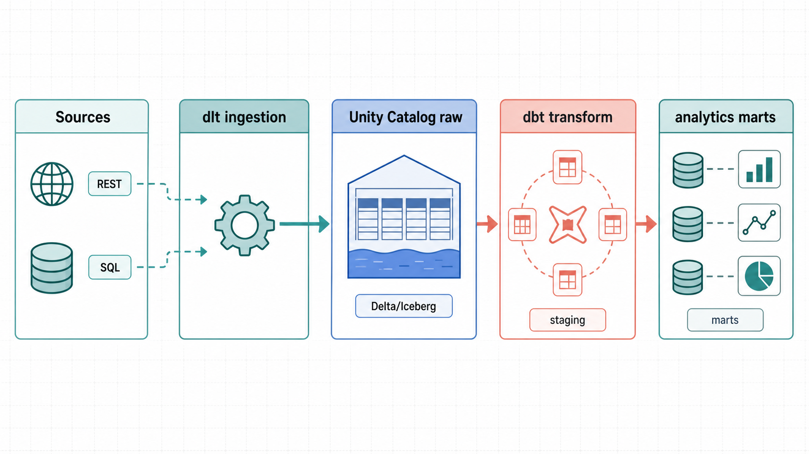

# dlt + dbt on Databricks

[](https://github.com/AndreaBozzo/dlt-dbt-databricks/actions/workflows/ci.yml)
[](LICENSE)
[](.python-version)

Advanced, **runnable** examples of [**dlt** (dlthub)](https://dlthub.com) ingestion and
[**dbt**](https://www.getdbt.com) transformation on **Databricks** (Unity Catalog + a SQL warehouse),
plus an on-demand **update radar** that tracks new releases across all three tools.

Every example here is validated against a real Databricks workspace — no dead demos. And the whole
dlt → dbt → quality-gate flow **also runs warehouse-free** (same pipelines and models, against
DuckDB) in CI on every PR: `make e2e-duckdb`.


> ⚠️ **`dlt` is not Databricks "DLT".**
> This repo uses **`dlt`** = the lowercase **dlthub** Python data-load library.
> Databricks' old **DLT / Delta Live Tables** is a *different* product, renamed in 2026 to
> **Lakeflow Spark Declarative Pipelines**. See [docs/glossary.md](docs/glossary.md).

## What's here

| Area | Path | Highlights |
| --- | --- | --- |
| Ingestion (dlt) | [`ingestion/`](ingestion/) | REST API + **real Postgres** → Databricks; merge/incremental, Iceberg, data contracts |
| Transformation (dbt) | [`transformation/dbt_databricks/`](transformation/dbt_databricks/) | staging→marts on dlt output **and** a real **insurance-claims** analytics layer |
| Orchestration | [`orchestration/`](orchestration/) | local dlt→dbt runner with a **warehouse-free DuckDB lane** (what CI runs) + a validated **Databricks Asset Bundle** ([`databricks.yml`](databricks.yml), [deploy guide](docs/deploy-databricks-bundle.md)) |
| Notebooks | [`notebooks/`](notebooks/) | Databricks notebook: dlt **zero-config** ingestion + claims-mart exploration |
| Agentic scenario | [`orchestration/agentic_quality_gate.py`](orchestration/agentic_quality_gate.py), [`docs/agentic-quality-gate.md`](docs/agentic-quality-gate.md) | AI-ready claims quality gate: promote / review / block with deterministic evidence |
| Update radar | [`updates/`](updates/) | dated, sourced notes on dlt / dbt / Databricks changes |
| Docs | [`docs/`](docs/) | Databricks setup, architecture, glossary |

## Architecture in one line

`dlt` extracts from a source (REST API, SQL DB) and **loads raw tables into a Unity Catalog schema**
→ **dbt** reads that schema as a `source` and builds `staging → intermediate → marts`. Full picture:
[docs/architecture.md](docs/architecture.md).



## Quickstart

Prereqs: [uv](https://docs.astral.sh/uv/), Python 3.12, a Databricks workspace with Unity Catalog and
a running SQL warehouse, and the [Databricks CLI](https://docs.databricks.com/dev-tools/cli/). Full
setup: [docs/setup-databricks.md](docs/setup-databricks.md).

```bash
# 1. Install (venv + deps + dbt packages)
make setup                  # or: uv sync --extra postgres && (cd transformation/dbt_databricks && uv run dbt deps)
make doctor                 # offline readiness check for env, dbt parse, CLI, and bundle config

# 2. Auth
databricks auth login --host https://YOUR_HOST.cloud.databricks.com   # OAuth for dbt (no PAT)
cp .env.example .env        # add a PAT for dlt + your host/http_path
cp transformation/dbt_databricks/profiles.yml.example transformation/dbt_databricks/profiles.yml

# 3. Ingest with dlt, then transform with dbt
make dlt-rest               # REST API → Unity Catalog (raw)
make dbt-build              # staging → marts (incl. the insurance-claims models)

# ...or both at once
make e2e
```

**No workspace yet?** Run the entire stack warehouse-free — the same dlt pipelines and dbt models
against a local DuckDB file, ending with the quality gate on the real dbt artifacts:

```bash
uv sync --extra duckdb
make e2e-duckdb             # dlt → DuckDB → dbt build → agentic quality gate
```

No `make` on Windows? Each target is a `uv run …` command — see the [`Makefile`](Makefile).

## Highlight examples

**dlt** ([`ingestion/`](ingestion/))
- `rest_api_to_databricks.py` — declarative REST API source, parent→child, merge.
- `sql_database_to_databricks.py` — replicate a **real public Postgres** table (incremental + merge),
  via a custom SQL resource that works even against locked-down read replicas.
- `advanced/` — `merge` upserts, **Iceberg** `table_format`, schema **contracts** + PK/FK hints.

**dbt** ([`transformation/dbt_databricks/`](transformation/dbt_databricks/))
- `stg_/int_/mart_` on the dlt output, with an **incremental merge** mart and tests.
- **Insurance analytics** on `samples.healthverity` (real synthetic claims, ~410k rows):
  `stg_claims → int_claims → mart_claims_by_payer / mart_member_summary`, with realistic
  data-quality handling of reversals (negative/NULL amounts) as `warn`-severity tests.

**Orchestration** — [`databricks.yml`](databricks.yml) is a `databricks bundle validate`-clean Asset
Bundle running dlt then dbt as a dependent Databricks Job (dev/prod targets).

**Agentic quality gate** — [`agentic_quality_gate.py`](orchestration/agentic_quality_gate.py) turns
dbt results + claims mart signals into a `promote` / `review` / `block` packet for an AI reviewer or
human owner. It runs offline with sample evidence:

```bash
make agent-gate
```

## What you learn

This repo is meant to surface the practical seams between the tools, not just prove that they can
run together:

- **The dlt/dbt contract**: dlt owns `raw`; dbt owns `analytics`; Unity Catalog is the stable handoff.
- **Operational ingestion patterns**: incremental SQL extraction without reflection, REST parent-child
  loading, merge upserts, schema contracts, and table-format choices.
- **Databricks deployment reality**: local OAuth for dbt, PAT/service-principal options for dlt,
  SQL warehouse compute boundaries, and Asset Bundle orchestration.
- **Analytics beyond toy data**: the claims models show how to handle reversals, null/negative money,
  line-detail grain, and warn-severity data quality checks without pretending real data is clean.

Example questions the dbt layer is set up to answer:

| Question | Model |
| --- | --- |
| Which payer/state/type combinations drive the most allowed amount? | `mart_claims_by_payer` |
| Which members have the highest utilization and cost? | `mart_member_summary` |
| How much do reversals and missing charge values affect quality checks? | `stg_claims`, `int_claims` |
| Did the latest dlt run produce the raw tables dbt expects? | `sources.yml` + dbt source tests |

## Known limitations

- A live Databricks workspace, Unity Catalog catalog, and SQL warehouse are required for
  Databricks-lane end-to-end runs (`make e2e`). The DuckDB lane (`make e2e-duckdb`) needs neither,
  but swaps `samples.healthverity` for a small checked-in sample CSV and skips the two
  Databricks-only dlt examples (Iceberg, UC constraints).
- `dbt parse` works offline, but `dbt build` on the default target needs warehouse connectivity and
  permissions to create schemas/tables.
- The Databricks Asset Bundle requires the Databricks CLI plus `DATABRICKS_HOST` or a configured CLI
  profile for validation/deploys.
- The SQL example uses a public read-only Postgres source by default. Swap the DSN before adapting it
  to a private operational database.
- Generated images in `docs/assets/` are project branding/docs assets, not architectural source of
  truth; the Mermaid/ASCII-style docs remain the precise implementation reference.

## Keeping up to date

[`updates/`](updates/) is a dated, sourced knowledge base on dlt / dbt / Databricks changes. It refreshes
two ways:

- **Automatically, daily** — a Claude Code cloud routine (`0 6 * * *`, 08:00 Europe/Rome) re-checks the
  release sources and opens a `radar/auto-YYYY-MM-DD` PR **only when something changed** (silent no-op
  otherwise). Details and how to manage it: [`updates/README.md`](updates/README.md#automated-daily-refresh-cloud-routine).
- **On demand** — ask the maintainer (or an agent) to "refresh the update radar" to web-fetch
  [`updates/sources.md`](updates/sources.md) and append dated entries.

## License

[Apache 2.0](LICENSE). Contributions welcome — see [CONTRIBUTING.md](CONTRIBUTING.md).
